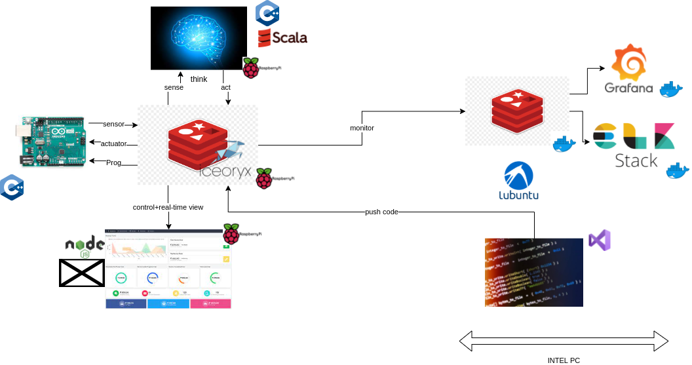
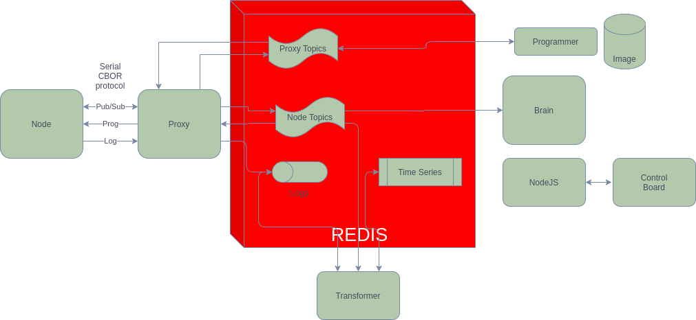

# Robotic Backbone

A generic PubSub communication protocol that enables small microcontrollers to be part of a bigger robot structure. uC considered are 256KB flash, 32KB RAM ( STM32F103 ).
The protocol should be able to be passed across serial, USB . Primary intention is to use this via USB CDC and UDP

# Components used
 
 # Integration 
 

# Roadmap

- implement CBOR serialization for protocol messages : Pub,Sub,..
- use a reflection API via C++ templates ( See Mira project C++ approach on serialization )
- the reflection enables reading, writing , documenting and sharing the structure
- use TinyCBOR for minimal memory footprint
- create generic proxy for any broker : Zenoh , Redis , Iceoryx
- enable selective publishing to lower update rate, maybe
- store historical data for time series

# Design goals

- the smallest possible implementation in C++ at uC side
- very compact protocol that makes maximum use of bandwidth ( topics and message types are identified by 1 byte id's)
- a generic PubSub protocol that enables integration of any PubSub broker at proxy side
- arrive at minimal latency E2E : uC <- middleware-> brain , in the order of a few millisec.
- Support wildcard matching on topics

# Base messages

These messages are send as a CBOR array ( 1 byte start and 1 byte end )
The messageType is 1 byte
The id is 1 byte

### Publish

- id, value , qos
- bi-directional

### Subscriber

- id, pattern

### Publisher

- id, topic

### Connect

- client Id

### Disconnect

- error

Keep alive to proxy is implementing by listening to own 'uptime' topic, this enables also latency measurement and publishing

## Build instructions

'''
git clone https://github.com/vortex314/broker-proxy
git submodule update --init --recursive
cd hiredis
make
sudo make install
cd ../tinycbor
make
sudo make install
'''

## RUN instructions

./redis-proxy -s /dev/ttyACM0 -b 1000000
./redis-proxy -s /dev/ttyUSB0 -b 921600

docker run -d \
 -p 3000:3000 \
 --net=host \
--name=grafana \
 -e "GF_INSTALL_PLUGINS=redis-datasource,grafana-simple-json-datasource" \
 grafana/grafana

 this takes a minute to start, 
 https://localhost:3000 => admin,admin

 
